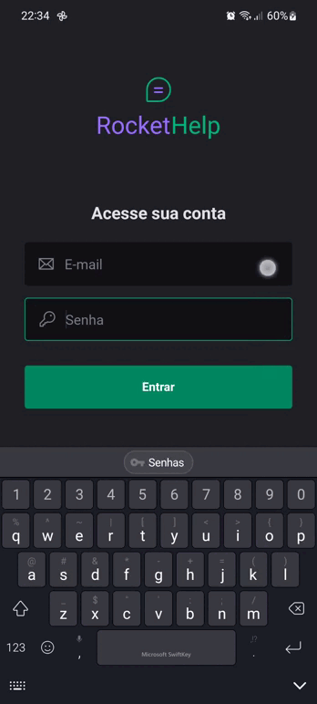

# RocketHelp

# Rocketseat Ignite Lab React Native

Evento da [Rocketseat](https://www.youtube.com/c/RocketSeat). Aplicativo para controle de solicitações de manutenção.

  

  

## Requerimentos

- [Node](https://nodejs.org)
- [yarn](https://yarnpkg.com/getting-started/install) ou [npm](https://www.npmjs.com)
- Requerimentos do [React Native](https://reactnative.dev)
- Configurar [Firebase](https://firebase.google.com) e usar seus próprios arquivos `google-services.json` e `GoogleService-Info.plist`, colocá-los na pasta raiz.

## Tech Stack

- [React](https://reactjs.org)
- [React Native](https://reactnative.dev)
- [TypeScript](https://www.typescriptlang.org)
- [Expo](https://expo.dev)
- [React Navigation](https://reactnavigation.org)
- [Native Base](https://nativebase.io)
- [Firebase](https://firebase.google.com)

## Contatos

Você pode me encontrar em qualquer uma das redes sociais abaixo:

Feito com 💜 por Filipe Ariel
